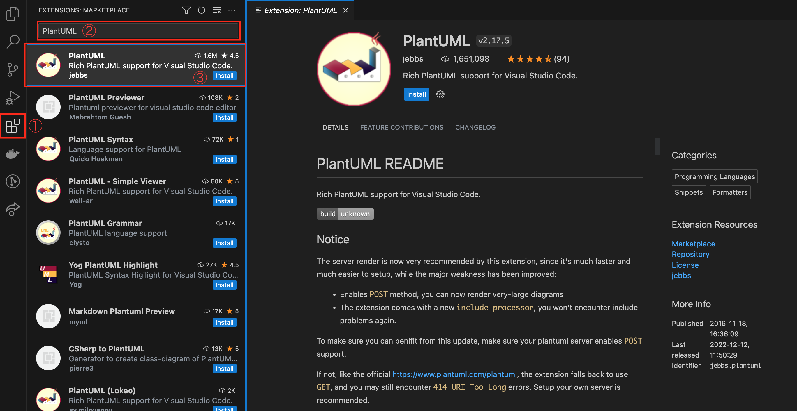

# PlantUML

## Install on Mac

```shell
% brew update
% brew doctor
```

### Java
```shell
% brew install java
% echo 'export PATH="/usr/local/opt/openjdk/libexec/openjdk.jdk/Contents/Home/bin:$PATH"' >> ~/.zshrc
% source ~/.zshrc
% which java    
/usr/local/opt/openjdk/libexec/openjdk.jdk/Contents/Home/bin/java
% java --version
openjdk 20.0.1 2023-04-18
OpenJDK Runtime Environment Homebrew (build 20.0.1)
OpenJDK 64-Bit Server VM Homebrew (build 20.0.1, mixed mode, sharing)
```

### PlantUML
```shell
% brew install plantuml
% which plantuml
/usr/local/bin/plantuml
% plantuml -version
PlantUML version 1.2023.10 (Thu Jul 13 00:54:07 JST 2023)
(GPL source distribution)
Java Runtime: OpenJDK Runtime Environment
JVM: OpenJDK 64-Bit Server VM
Default Encoding: UTF-8
Language: en
Country: JP
 
PLANTUML_LIMIT_SIZE: 4096

Dot version: dot - graphviz version 8.1.0 (20230707.0739)
Installation seems OK. File generation OK
```

## VSCode


### Extension



### Sample
sample.plantuml
```shell
@startuml

/' define participants '/

actor User
participant App
database DB
hide footbox

/' messages '/

User->App : request
activate App
App->App : validate
opt len(err) > 0
  App->User : argument error
end

App->DB : save
activate DB
DB-->App
deactivate DB
opt len(err) > 0
  App->User : DB error
end

User<--App : response
deactivate App

@enduml
```

### Shortcuts

|command|description|
|--|--|
|`alt`+`D`|Preview|

## jQuery and HTML
  
No need to install above if you use jQuery and HTML.  
Download the files below instead.  
- <a href="jquery.js" target="_blank">jquery.js</a>
- <a href="jquery_plantuml.js" target="_blank">jquery_plantuml.js</a>
- <a href="rawdeflate.js" target="_blank">rawdeflate.js</a>

### Sample
sample.html
```html
<html>
<head>
<script type="text/javascript" src="jquery.js"></script>
<script type="text/javascript" src="jquery_plantuml.js"></script>
<script type="text/javascript" src="rawdeflate.js"></script>
</head>
<body>
App : request
activate App
App->App : validate
opt len(err) > 0
  App->User : argument error
end
App->DB : save
activate DB
DB-->App
deactivate DB
opt len(err) > 0
  App->User : DB error
end
User<--App : response
deactivate App
">
</body>
</html>
```

## Output
App : request
activate App
App->App : validate
opt len(err) > 0
  App->User : argument error
end
App->DB : save
activate DB
DB-->App
deactivate DB
opt len(err) > 0
  App->User : DB error
end
User<--App : response
deactivate App
">

## References

- https://qiita.com/ogomr/items/0b5c4de7f38fd1482a48
- https://zenn.dev/kitabatake/articles/006ca2947f309a074939
- https://www.wakuwakubank.com/posts/805-design-uml-er/
- https://plantuml.com/jquery


<script defer type="text/javascript" src="jquery.js"></script>
<script defer type="text/javascript" src="jquery_plantuml.js"></script>
<script defer type="text/javascript" src="rawdeflate.js"></script>